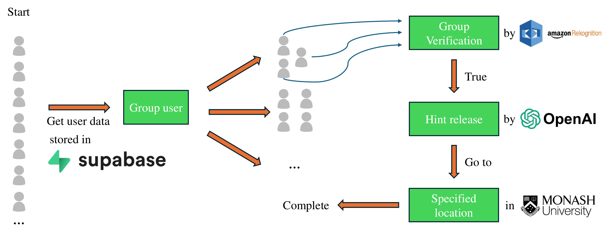

# Scavenger Hunt App

A modern, interactive scavenger hunt application built with Next.js, TypeScript, and Supabase. This application allows users to participate in digital scavenger hunts, scan QR codes, and track their progress in real-time.

## 🚀 Features

- **QR Code Scanning**: Built-in QR code scanner for finding clues
- **Real-time Progress Tracking**: Monitor hunt progress with interactive UI
- **Admin Dashboard**: Create and manage scavenger hunts
- **User Authentication**: Secure login with Supabase
- **Responsive Design**: Works seamlessly on mobile and desktop
- **Dark Mode Support**: Built-in theme switching

## 🛠️ Tech Stack

- **Framework**: Next.js 15 with App Router
- **Language**: TypeScript
- **Styling**: Tailwind CSS
- **UI Components**: Shadcn UI / Radix UI
- **Authentication**: Supabase
- **Form Handling**: React Hook Form + Zod
- **QR Code Processing**: jsQR
- **Cloud Storage**: AWS SDK
- **AI Integration**: OpenAI
- **Notifications**: Sonner

## 📋 Prerequisites

- Node.js (v18 or later)
- npm or yarn
- Supabase account
- AWS account (for storage)
- OpenAI API key

## 🚀 Getting Started

1. **Clone the repository**
   ```bash
   git clone [repository-url]
   cd scavengerhunt
   ```

2. **Install dependencies**
   ```bash
   npm install
   # or
   yarn install
   ```

3. **Set up environment variables**
   Create a `.env.local` file with the following variables:
   ```
   NEXT_PUBLIC_SUPABASE_URL=your-supabase-url
   NEXT_PUBLIC_SUPABASE_ANON_KEY=your-supabase-anon-key
   AWS_ACCESS_KEY_ID=your-aws-access-key
   AWS_SECRET_ACCESS_KEY=your-aws-secret-key
   AWS_REGION=your-aws-region
   OPENAI_API_KEY=your-openai-api-key
   ```

4. **Run the development server**
   ```bash
   npm run dev
   # or
   yarn dev
   ```

5. Open [http://localhost:3000](http://localhost:3000) in your browser

## 📁 Project Structure

```
src/
├── app/                 # Next.js App Router pages
│   ├── admin/          # Admin dashboard routes
│   ├── api/            # API routes
│   └── dashboard/      # User dashboard routes
├── components/         # Reusable UI components
├── contexts/          # React context providers
└── lib/               # Utility functions and configurations
```

## 🔑 Key Features

- **QR Code Integration**: Built-in scanner for finding and validating clues
- **Real-time Updates**: Live progress tracking and notifications
- **Admin Controls**: Create and manage hunts, view participant progress
- **User Dashboard**: Track progress, view completed clues
- **Responsive Design**: Optimized for both mobile and desktop use
- **Secure Authentication**: Email-based login with Supabase

## 🛠️ Development

- **TypeScript**: Strict type checking enabled
- **ESLint**: Code quality and style enforcement
- **Turbopack**: Fast development server
- **Tailwind CSS**: Utility-first styling
- **Shadcn UI**: Pre-built component library

## 📝 License

This project is licensed under the MIT License - see the LICENSE file for details.

## 🤝 Contributing

Contributions are welcome! Please feel free to submit a Pull Request.
